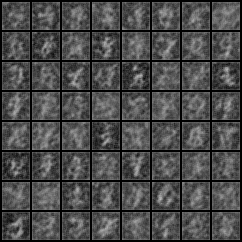
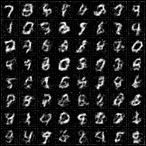
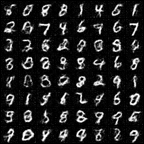
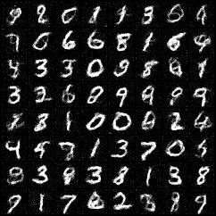
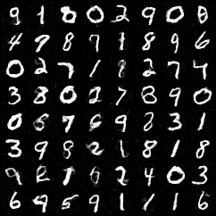

# Consistency Training for MNIST — 单文件实现

[`consistency_mnist.py`](consistency_mnist.py) 是 Song et al., *Consistency Models* (arXiv:2303.01469) 中
**Consistency Training (CT，无教师版)** 的一份单文件干净实现，专门跑在 MNIST 上。

> **关于本仓库**：本仓 fork 自 [openai/consistency_models](https://github.com/openai/consistency_models)。
> `main` 分支只保留为面试交付的 MNIST 单文件实现 + 训练报告；
> 原作者的多模块实现（`cm/`、`scripts/`、`evaluations/` 等）完整保存在 [`upstream`](../../tree/upstream) 分支，未做改动。

---

## 1. 文件清单

```
consistency_mnist.py            # 全部代码（UNet + CM 参数化 + 课程 + loss + 采样 + 训练循环）
README.md                       # 本文件（含训练报告）
runs/ct_mnist/samples/*.png     # 5 张代表性采样图（训练进度对比 + 最终 NFE=1/2）
```

单文件，无外部脚本依赖（`cm/` 等模块只在 `upstream` 分支里）。

---

## 2. 环境

- Python ≥ 3.9
- PyTorch ≥ 2.0（CUDA 版本任意；MNIST 单卡 16GB 显存绰绰有余）
- torchvision（数据集 + `save_image`）

```bash
pip install torch torchvision
```

可选（算 FID 时才需要）：

```bash
pip install torchmetrics[image]
```

---

## 3. 运行

### 训练

```bash
python consistency_mnist.py train --out-dir runs/ct_mnist
```

默认配置：`total_steps=50000, batch_size=256, lr=1e-4, loss=l2`。

常用调整：

```bash
# 更长训练 + Pseudo-Huber loss（iCT 改进，更稳）
python consistency_mnist.py train \
    --out-dir runs/ct_mnist_huber \
    --total-steps 100000 \
    --loss-type huber

# 显存紧张时减小 batch
python consistency_mnist.py train --batch-size 128
```

### 采样

训练完之后用 final checkpoint 出 NFE=1 / 2 / 4 三种步数的 grid：

```bash
python consistency_mnist.py sample \
    --ckpt runs/ct_mnist/model_final.pt \
    --out-dir runs/ct_mnist/samples_final \
    --n-samples 64
```

---

## 4. 期望产出

训练目录结构：

```
runs/ct_mnist/
├── samples/
│   ├── step002000_nfe1.png    # 训练中每 2k step 的可视化
│   ├── step002000_nfe2.png
│   ├── ...
│   └── step050000_nfe2.png
├── model_step010000.pt        # 每 10k step 一个
├── model_step020000.pt
├── ...
└── model_final.pt
```

训练效果（参考值，单卡 RTX 3090/4080 / 类似 16GB）：

| step | NFE=1 视觉质量 | wall-clock |
|---|---|---|
| 2k   | 噪声 + 模糊轮廓 | ~3 min |
| 10k  | 部分能认出数字 | ~15 min |
| 25k  | 大部分清晰 | ~40 min |
| 50k  | 清晰、多样性合理；NFE=2 更锐 | ~1.5 h |

CPU 上能跑通（用作 smoke test），但完整训练只在 GPU 上现实。

---

## 4.1 本仓实测结果

单卡 **RTX 4070 Ti SUPER 16GB**，默认配置（`base_channels=64`, batch=256, L2 loss），50k step 用时约 **2.4h**，模型 6.55M 参数。

NFE=1 训练进度（每张为 8×8 = 64 个独立采样的 grid）：

| step 2k | step 10k | step 24k | step 50k |
| :-: | :-: | :-: | :-: |
|  |  |  |  |
| 模糊灰团 | 数字轮廓出现 | 大部分能认 | 清晰多样 |

最终 step 50k 的 NFE=2 对比（多调用一次 UNet 换更锐的图）：



末段训练日志（loss 已稳定在 ~7e-4，N(k) 触顶 150，μ(k) 收敛到 0.9993）：

```text
[step  49000/50000] loss=0.0006  N(k)=150  μ(k)=0.9993
[step  49500/50000] loss=0.0007  N(k)=151  μ(k)=0.9993
[step  50000/50000] loss=0.0007  N(k)=151  μ(k)=0.9993
[done] checkpoints in runs/ct_mnist
```