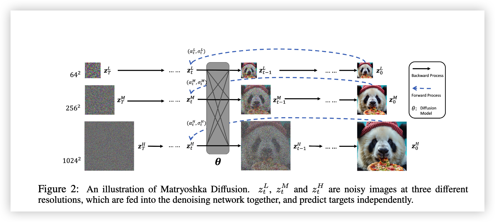
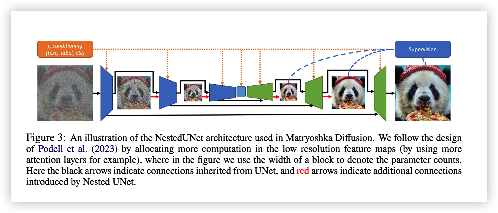
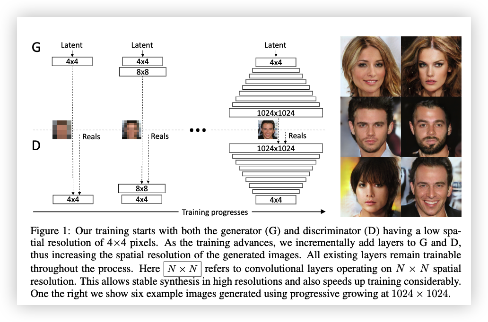
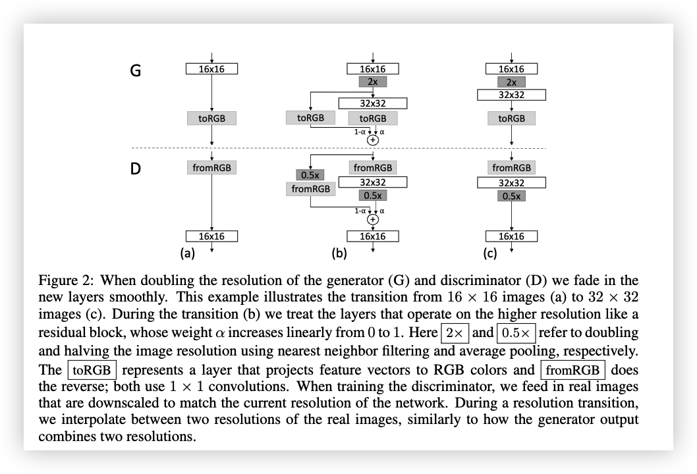
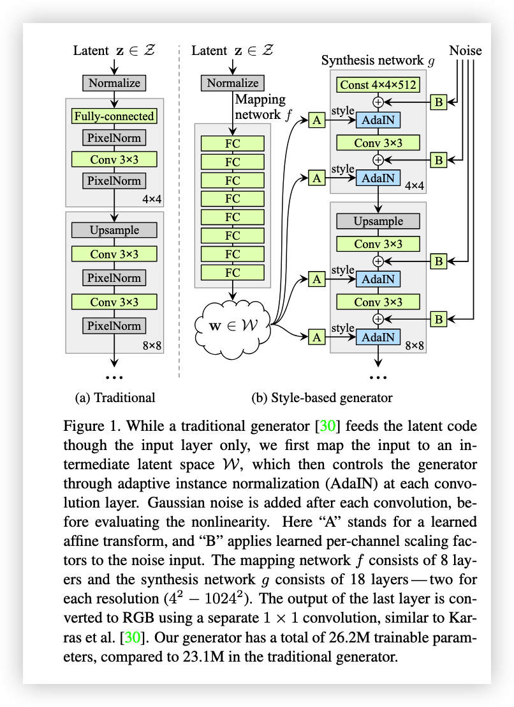
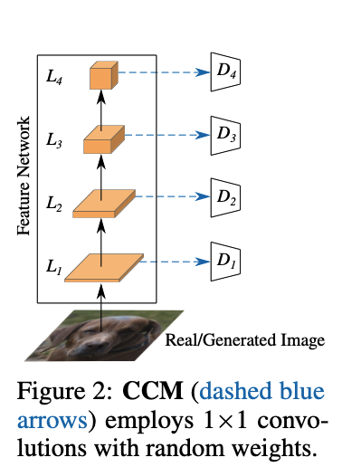
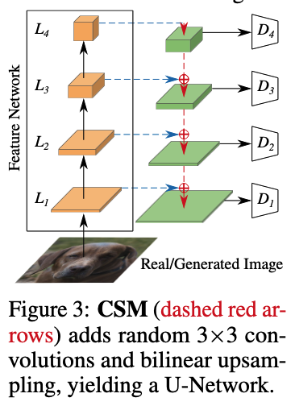

# Day 2 文献调研报告

**Date**: 2026-05-10
**Today's reading**: Matryoshka Diffusion / Progressive Growing（PHGGAN） / StyleGAN / Projected GANs

**报告结构**：

1. 多尺度生成方法
2. Matryoshka Diffusion Models 论文综述
3. LAPGAN 论文综述
4. Progressive Growing of GANs 论文综述
5. StyleGAN 论文综述（含 Multiscale Discriminator 分析）
6. Projected GANs 论文综述


---

## 1. 多尺度生成方法

四类方法的层级关系

本节阅读的四种方法**并非同一层级**，而是分别作用于生成器的不同环节：

```
┌─────────────────────────────────────────────────────────────────┐
│                     多尺度图像生成方法全景                        │
├─────────────────┬─────────────────┬─────────────────────────────┤
│   生成器架构     │   训练策略       │      判别器设计              │
├─────────────────┼─────────────────┼─────────────────────────────┤
│ • LAPGAN        │ • Progressive   │ • Projected GANs            │
│   (Laplacian 
   pyramid )      │   Growing       │   (特征空间多尺度判别)         │
│                 │   (G和D同步      │                             │
│ • Matryoshka    │    渐进增长)     │       
│                 │                 │                             │
└─────────────────┴─────────────────┴─────────────────────────────┘
```


---

## 2. Matryoshka Diffusion Models (Gu et al., ICLR 2024)

### 2.1 问题背景

高分辨率图像/视频生成面临两个根本挑战：
- **计算挑战**：直接在像素空间训练高分辨率扩散模型，每一步都要处理完整分辨率，训练成本极高
- **优化挑战**：高维空间的扩散过程优化困难，容易陷入局部最优

已有解法：
- **Cascaded Diffusion** (Imagen, DALL-E 2)：多个独立模型级联，低分辨率生成 → 上采样 → 高分辨率 refinement。问题是每个组件单独训练，pipeline 复杂，误差会累积
- **Latent Diffusion** (Stable Diffusion)：在预训练 VAE 的压缩 latent 空间做扩散。问题是 VAE 压缩有损，限制了生成质量上限
- **End-to-end 方法** (Hoogeboom et al., 2023)：直接训练高分辨率模型，但效果落后于 cascaded/latent 方法

### 2.2 核心思想

**关键洞察**：高分辨率扩散过程可以"嵌套"在低分辨率过程内部，共享计算和参数，而非像 cascaded 方法那样训练多个独立模型。

具体做法：
1. **扩展空间中的扩散**：定义多分辨率 latent 变量 $z_t = [z_t^1, z_t^2, ..., z_t^R]$，其中每个 $z_t^r$ 对应一个分辨率级别
2. **NestedUNet 架构**：低分辨率特征计算被"嵌套"在高分辨率块内部递归调用，大部分参数集中在最低分辨率层
3. **多分辨率联合去噪**：所有分辨率同时去噪，共享同一个网络，而非级联

### 2.3 关键架构特性

#### 图2：Matryoshka Diffusion 整体流程



> **Figure 2**: An illustration of Matryoshka Diffusion. $z_t^L$, $z_t^M$ and $z_t^H$ are noisy images at three different resolutions, which are **fed into the denoising network together**, and **predict targets independently**.

**图中元素详解：**

| 符号 | 含义 | 说明 |
|------|------|------|
| $z_T^L$ | Low-resolution noisy image | 低分辨率（$64^2$）噪声图像，时间步 $T$ |
| $z_T^M$ | Mid-resolution noisy image | 中分辨率（$256^2$）噪声图像，时间步 $T$ |
| $z_T^H$ | High-resolution noisy image | 高分辨率（$1024^2$）噪声图像，时间步 $T$ |
| $\theta$ | NestedUNet（灰色块） | 共享的去噪网络，同时处理三个分辨率 |
| $(\alpha_t^r, \sigma_t^r)$ | 分辨率特定的噪声调度 | 每个分辨率有独立的 noise schedule（蓝色虚线） |
| $z_0^L, z_0^M, z_0^H$ | 去噪后的清晰图像 | 三个分辨率同时输出去噪结果 |

**为什么需要三个尺寸的噪声？**

这是 Matryoshka 与 Cascaded Diffusion 的本质区别：
- **Cascaded Diffusion**：先生成 $64^2$，再用它作为条件生成 $256^2$，再生成 $1024^2$（**串行依赖**，每步只有一个分辨率活跃）
- **Matryoshka**：三个分辨率**同时**进入同一个网络，**并行**去噪（**嵌套而非级联**）

三个尺寸的噪声来自同一张原始图像 $x$ 的下采样版本：$x^L = D^L(x)$, $x^M = D^M(x)$, $x^H = x$。然后分别加噪得到 $z_T^L, z_T^M, z_T^H$。这样设计的目的是让网络**在同一时间步同时学习不同尺度的去噪目标**，实现参数共享和多尺度联合优化。

---

#### 图3：NestedUNet 详细架构



> **Figure 3**: An illustration of the NestedUNet architecture. We follow the design of Podell et al. (2023) by **allocating more computation in the low resolution feature maps** (by using more attention layers for example), where in the figure we use **the width of a block to denote the parameter counts**. Here the **black arrows** indicate connections inherited from UNet, and **red arrows** indicate additional connections introduced by Nested UNet.

**图中元素详解（从左到右）：**

**输入侧（最左侧）**：
- 噪声图像输入（图示为模糊的熊猫图像）
- 橙色虚线箭头（"$t$, conditioning (text, label, etc.)"）：时间步和条件信息（如文本、类别标签）从上方注入每一层

**Encoder（蓝色块，左半部分）**：
- 蓝色块的**宽度代表参数量**：最左侧的蓝色块最宽（低分辨率层有大量 self-attention 层）
- 向右逐渐变窄（高分辨率层参数少）
- 这体现了论文的核心设计：**把大部分计算放在低分辨率特征图上**

**Bottleneck（中间最窄处）**：
- 网络的"内核"，最低分辨率处进行最复杂的计算

**Decoder（绿色块，右半部分）**：
- 对称的上采样结构，从窄变宽
- 红色箭头：**NestedUNet 相比标准 UNet 新增的跨分辨率连接**，实现嵌套计算
- 黑色箭头：标准 UNet 的 skip connections

**输出侧（最右侧）**：
- 蓝色虚线箭头（"Supervision"）：多分辨率监督信号
- 最终输出清晰图像

**NestedUNet 的核心创新**：

标准 UNet 只在单一分辨率上计算，而 NestedUNet 把**低分辨率计算嵌套在高分辨率块内部递归调用**。想象俄罗斯套娃：
- 最内层（最低分辨率）：承担主要计算（self-attention、复杂卷积）
- 外层（高分辨率）：只添加轻量级上采样和细节补充，复用内层计算结果

这种设计使得 MDM 能用**单模型**同时处理多分辨率，参数效率远高于 Cascaded Diffusion（后者需要独立训练多个完整模型）。

**渐进式训练 (Progressive Training)**：

虽然 MDM 可以直接 end-to-end 训练，但作者发现简单的 progressive training 能显著加速高分辨率模型收敛：
1. 先训练低分辨率 (如 64²) 若干 steps
2. 逐步添加更高分辨率到训练目标中
3. 避免从一开始就训练高分辨率带来的优化困难

**多分辨率损失**：

$$\mathcal{L}_\theta = \mathbb{E}_{t \sim [1,T]} \mathbb{E}_{z_t \sim q(z_t|x)} \sum_{r=1}^R \left[ \omega_t^r \cdot \| x_\theta^r(z_t, t) - D^r(x) \|_2^2 \right]$$

- $\omega_t^r$: 分辨率特定权重，默认 $\omega_t^r / \omega_t^R = N_R / N_r$
- 所有分辨率联合优化，而非各自独立

### 2.4 关键结果

**ImageNet 256×256** (class-conditional):
- MDM: FID 3.51 (with CFG)
- 对比: ADM (10.94), CDM (4.88), LDM-4 (3.60)

**CC12M 1024×1024** (text-to-image):
- 单像素空间模型，无 latent compression
- 在仅 1200 万张图的数据集上展现出强 zero-shot 能力

**关键发现**：
- MDM 收敛速度显著快于 cascaded DM 和 simple DM baseline
- Progressive training 进一步加速收敛
- 增加 nesting levels（从 2 层到 3 层）能稳定提升性能，边际成本可忽略

---

## 3. LAPGAN 与 Matryoshka 的对比

| 维度 | Matryoshka Diffusion | LAPGAN |
|------|---------------------|--------|
| **结构关系** | **嵌套 (Nested)**：低分辨率计算嵌套在高分辨率内部 | **级联 (Cascaded)**：各尺度顺序依赖 |
| **模型数量** | **单个模型**：NestedUNet 同时处理所有分辨率 | **多个模型**：每个尺度一个独立的 G/D |
| **参数共享** | **深度共享**：大部分参数在低分辨率层，高分辨率层复用 | **无共享**：每个尺度独立参数 |
| **生成方式** | **并行去噪**：所有分辨率同时去噪 | **串行生成**：先生成低分辨率，再逐级添加细节 |
| **训练目标** | 多分辨率联合损失 | 各尺度独立对抗损失 |

---

## 4. Progressive Growing of GANs (Karras et al., ICLR 2018)--PGGAN

| 维度         | LAPGAN                             | PGGAN                    |
| ------------ | ---------------------------------- | ------------------------ |
| **图像表示** | Laplacian pyramid 分解（显式残差） | 单分辨率图像             |
| **网络结构** | 每层独立 GAN                       | 单一网络渐进添加层       |
| **参数共享** | ❌ 无共享                           | ✅ 同一网络逐步加深       |
| **频率分离** | ✅ 显式（residual bands）           | ❌ 隐式（网络不同层学习） |

### 4.1 核心思想与训练流程

PGGAN 提出了一种**渐进式增长训练方法**：从低分辨率 (4×4) 开始训练 GAN，逐步添加新层增加分辨率，直到目标分辨率 (1024×1024)。生成器 (G) 和判别器 (D) 同步增长，所有已训练的层在整个过程中保持可训练。

**关键洞察**：高分辨率图像生成困难的原因是——高分辨率下更容易区分生成图像和真实图像，导致梯度问题被放大；同时大分辨率需要更小的 batch size，进一步损害训练稳定性。渐进式增长让网络先学习大尺度结构，再逐步关注细粒度细节，而非同时学习所有尺度。

### 4.2 图1：渐进式增长整体流程



> **Figure 1**: 训练从 G 和 D 都具有 4×4 低空间分辨率开始。随着训练进行，逐步向 G 和 D 添加层，从而增加生成图像的空间分辨率。所有已有层在整个过程中保持可训练。右侧展示了使用渐进式增长在 1024×1024 生成的六张示例图像。

**图中元素详解（从左到右）：**

| 符号 | 含义 | 说明 |
|------|------|------|
| **G** | Generator (生成器) | 从 Latent vector 生成图像，结构自下而上增长 |
| **D** | Discriminator (判别器) | 判断输入是真实图像还是生成图像，结构自上而下增长 |
| **4×4 / 8×8 / ... / 1024×1024** | 卷积层操作的空间分辨率 | N×N 表示在该分辨率上操作的卷积层 |
| **虚线箭头** | 数据流向 | 展示训练和生成过程中的数据流动 |
| **Reals** | 真实图像下采样 | 真实图像被下采样到当前网络分辨率用于训练 |

**渐进式增长的步骤：**

1. **初始阶段 (4×4)**：G 和 D 都只有最基础的 4×4 层
   - G：Latent → 4×4 Conv → 输出 4×4 RGB
   - D：4×4 RGB → 4×4 Conv → 输出 critic score

2. **增长阶段**：每隔一定迭代次数，同时给 G 和 D 添加新层，分辨率翻倍
   - 4×4 → 8×8 → 16×16 → 32×32 → 64×64 → 128×128 → 256×256 → 512×512 → 1024×1024

3. **Fade-in 平滑过渡**：新层通过线性插值平滑加入（见 Figure 2 详解）

### 4.3 图2：Fade-in 平滑过渡机制



> **Figure 2**: 当 G 和 D 的分辨率翻倍时，平滑地 fade in 新层。这个例子展示了从 16×16 (a) 到 32×32 (c) 的过渡。在过渡阶段 (b)，处理更高分辨率的层被当作残差块，其权重 α 从 0 线性增加到 1。

**Fade-in 机制详解（以 16×16 → 32×32 为例）：**

Generator 侧：
```
Latent → 16×16 层 ─┬─→ toRGB ──→ (1-α) × 旧输出 ──┐
                   │                                ├──→ 最终输出 32×32
                   └─→ 2× 上采样 → 新 32×32 层 ──→ α × 新输出 ──┘
```

- α 从 0 线性增加到 1
- 当 α=0 时：完全使用旧分辨率路径
- 当 α=1 时：完全使用新分辨率路径

**Fade-in 的目的**：避免对已训练层的突变冲击，实现平滑过渡。

### 4.4 与 StyleGAN 的关系

**StyleGAN 继承自 PGGAN**：

- StyleGAN 复用 PGGAN 的 discriminator 架构、progressive growing 训练策略、Adam 超参数、EMA
- 使用相同的分辨率相关 minibatch size 和 WGAN-GP / R1 regularization

**StyleGAN2 的改进**：
- **放弃 Progressive Growing**，发现它是 phase artifacts 的根源
- 改为 full resolution + skip connections + path length regularization

**关键结论**：Progressive growing 被 StyleGAN2 抛弃不是因为 idea 本身不好，而是因为实现方式有缺陷。MSG-GAN 和 Matryoshka 证明了同样的"多尺度训练"目标可以用更优雅的方式实现，无需复杂的 progressive schedule。

---

## 5. StyleGAN (Karras et al., CVPR 2019)

### 5.1 问题背景与动机

传统 GAN generator 的 latent code 仅通过输入层（第一层）进入网络，之后网络像个黑箱一样把 latent code 逐步转换成图像。这种设计有三个问题：

1. **Latent space 纠缠**：输入 latent space Z 必须遵循训练数据的概率密度分布
2. **缺乏对合成过程的控制**：无法按尺度独立控制生成过程
3. **随机变异的来源不明确**：网络被迫从前向传播中"发明"伪随机变化

**核心创新**：
- **Mapping network**：把 Z 映射到中间 latent space W，W 不受训练数据分布约束
- **AdaIN**：通过 style 参数调制每层特征图
- **Noise injection**：每层注入独立噪声，提供随机细节来源

### 5.2 核心架构

#### 图1：Traditional vs Style-based Generator



**Style-based Generator 是两个子网络的组合**：

```
┌─────────────────────────────────────────────────────────────────────┐
│                    Style-based Generator (图1b)                      │
├─────────────────────────┬───────────────────────────────────────────┤
│      左侧: Mapping      │              右侧: Synthesis                │
│    network f (8层MLP)   │           network g (18层CNN)             │
│                         │                                           │
│   z → [8×FC] → w ∈ W    │   Const → Conv → AdaIN → Upsample → ...  │
│  (把输入latent映射到      │  (从常数开始，用style控制每层)              │
│   中间latent空间W)        │                                           │
└─────────────────────────┴───────────────────────────────────────────┘
```

**关键组件**：

| 符号 | 含义 | 作用 |
|------|------|------|
| **Mapping network f** | 8 层全连接 MLP | 把 Z 映射到中间空间 W（维度 512） |
| **w ∈ W** | 中间 latent 向量 | 无分布约束，可被塑造成更解纠缠的表示 |
| **A** (Affine transform) | 学习到的全连接层 | 把 w 转换为 style y = (y_s, y_b) |
| **AdaIN** | Adaptive Instance Normalization | 用 style 参数调制特征图 |
| **Const 4×4×512** | 学习到的常数张量 | Synthesis network 的起点 |
| **Noise** | 单通道高斯噪声 | 每层注入的随机变量 |

**AdaIN 公式**：
$$\text{AdaIN}(x_i, y) = y_{s,i} \cdot \frac{x_i - \mu(x_i)}{\sigma(x_i)} + y_{b,i}$$

### 5.3 Multiscale Discriminator 分析

StyleGAN 使用了 **Progressive Growing** 策略，这本质上是一种**多尺度训练方式**：
- 训练过程中网络逐步接触更高分辨率
- 判别器从低分辨率开始，逐步增加判别尺度

但 StyleGAN 的判别器本身是**单尺度的**——在任意时刻，判别器只处理一个分辨率。真正的 **Multiscale Discriminator** 概念在 Projected GANs 中得到充分体现。

---

## 6. Projected GANs Converge Faster (Sauer et al., NeurIPS 2021)

### 6.1 核心思想

**关键洞察**：传统 GAN 判别器直接在 RGB 像素空间工作，训练困难且需要大量正则化。Projected GAN 将生成图像和真实图像**投影到预训练特征网络的特征空间**，在投影后的特征空间中进行判别。

**为什么这样做有效？**
1. **预训练特征更稳定**：预训练网络（如 EfficientNet）已经学到了丰富的视觉表示
2. **多尺度特征金字塔**：预训练网络不同层捕获不同尺度的特征
3. **判别器更容易训练**：在有意义的特征空间中区分真假，比在原始像素空间更容易

### 6.2 关键架构组件

#### 图2 & 图3：Cross-Channel Mixing (CCM) 与 Cross-Scale Mixing (CSM)



**Figure 2: CCM (Cross-Channel Mixing)**

```
Real/Generated Image
        ↓
┌─────────────────────────────┐
│    Feature Network          │  ← 预训练网络 (EfficientNet)，frozen
│    (预训练特征网络)          │
│                             │
│   L₁ ──────→ D₁            │  ← L₁: 64² 分辨率特征图
│   L₂ ──────→ D₂            │  ← L₂: 32² 分辨率特征图
│   L₃ ──────→ D₃            │  ← L₃: 16² 分辨率特征图
│   L₄ ──────→ D₄            │  ← L₄: 8² 分辨率特征图
└─────────────────────────────┘
```

**CCM 的核心作用**：
- **问题**：预训练网络深层特征往往非常稀疏
- **解决**：用 1×1 卷积**随机混合所有通道**（权重随机初始化，不训练）
- **效果**：判别器无法"选择性忽视"，必须学会利用**所有通道**的信息

**Figure 3: CSM (Cross-Scale Mixing)**

CSM 在 CCM 基础上添加**跨尺度连接**，构建 U-Net 结构：
- 低分辨率特征（深层，语义强）通过 3×3 Conv + Bilinear Upsample 传到高分辨率层
- 让深层语义信息回流到浅层，帮助浅层判别器获得全局上下文

**CSM vs CCM 对比**：

| 特性 | CCM | CSM |
|------|-----|-----|
| **结构** | 平行独立 | U-Net 跨层连接 |
| **信息流动** | 只从图像→特征→判别器 |  additionally 深层→浅层 |
| **参数量** | 少（只有 1×1 Conv） | 稍多（3×3 Conv + 上采样）|
| **效果** | 解决通道稀疏 | 解决浅层缺乏语义 |

**论文实验结果**：
- CCM alone: rel-FID = 0.77
- CCM + CSM: rel-FID = **0.24** (显著更好！)

### 6.3 关键实验发现

**收敛速度**：
- Projected FastGAN 在 **1.1M images** 时达到 StyleGAN2 (88M images) 的 FID
- **40倍加速**：wall-clock 时间从 5 天降到 3 小时

**数据效率**：
- 在 CLEVR 数据集上，仅用 1k/10k 样本也能取得优异效果
- 对小数据集特别友好

**定量结果**：

| 数据集 | StyleGAN2-ADA | FastGAN | Projected GAN |
|--------|---------------|---------|---------------|
| CLEVR | 10.17 | 3.24 | **0.89** |
| FFHQ | 7.32 | 12.69 | **3.08** |
| Cityscapes | 8.35 | 8.78 | **3.41** |
| LSUN-Church | 5.85 | 8.43 | **1.59** |


---

## 7. 下一步阅读计划

### 7.1 多尺度/生成架构深化

| 优先级 | 论文 | 为什么读 |
|---|---|---|
| 中 | **StyleGAN2/3** 技术报告 | 理解 progressive growing 被弃用的原因及替代方案 |


### 7.2 Wavelet + 生成（diffusion）

| 优先级 | 论文 | 为什么读 |
|---|---|---|
| **高** | **Wavelet Diffusion Models are fast and scalable Image Generators** (2023) | Wavelet 在 diffusion 中最经典的用法，必读基础 |


---

**关键待探索问题**：
1. Wavelet-CT 的 consistency loss 应该定义在 pixel space 还是 wavelet space？
2. 如何设计 wavelet 子带间的 mixing 机制？
3. Progressive training 对 CT 是否有效？（从低频子带逐步加入高频子带）
4. **Wavelet 相关的已有工作是否已覆盖类似思路？**（需在阅读中确认）
